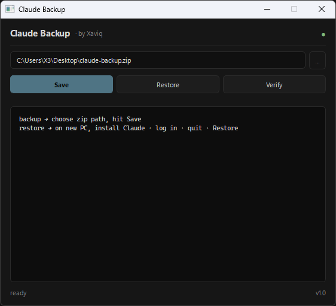
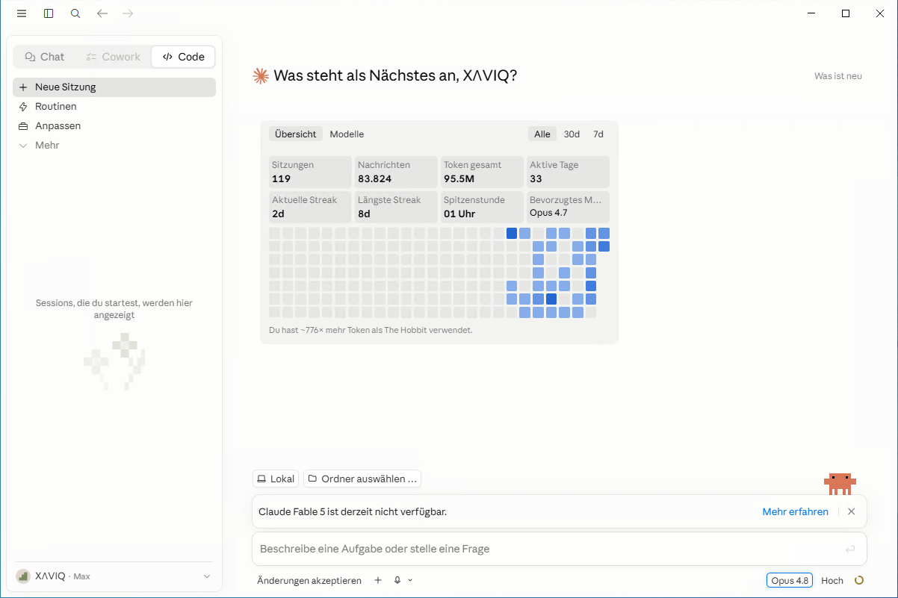
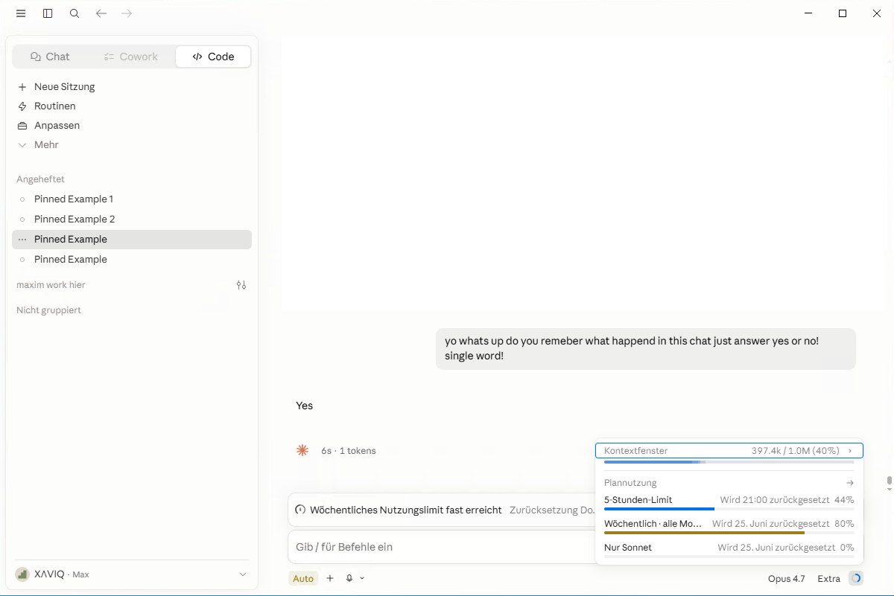
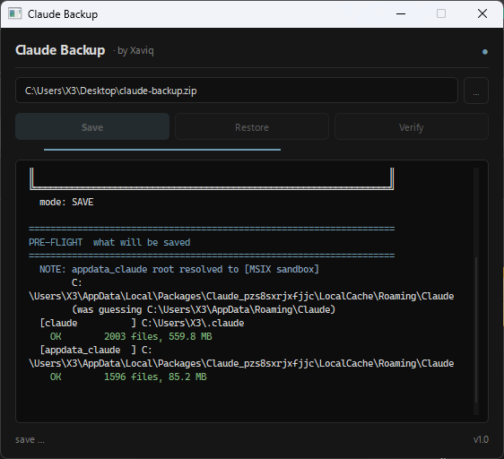

# Claude Backup

Save & restore everything inside the **Code tab** of the Claude Desktop App on Windows — sessions, pinned workspaces, group names, project memory — between PCs.

By Xaviq.



---

## Scope — read this first

This tool is **only** for the **Code tab** of the **Claude Desktop App on Windows**.

| What | Where it lives | Covered by this tool? |
|---|---|---|
| **Code tab** sessions, pins, groups, project memory | Locally, in the Claude Desktop App's MSIX sandbox on your PC | **YES** |
| **Chat tab** conversations (the normal claude.ai chats) | On Anthropic's servers, synced via your account | **NO** — just log in on the new PC, they appear automatically |
| **Cowork tab** | Locally (agent VM state) | YES (sub-agent state is included) |
| Claude on macOS, Linux, web, mobile | — | NO. Windows only. |

If your sessions live in the cloud (the normal **Chat** tab), you don't need this tool — your data is on Anthropic's servers and re-appears on any device you log into. This tool exists because the **Code tab** stores its sessions locally on your PC, so reinstalling Windows or moving to a new PC normally wipes them.

---

## Why

The Code tab stores everything locally in an MSIX-virtualised sandbox under `%LOCALAPPDATA%\Packages\Claude_*\`. A naive folder copy doesn't survive a PC swap: the encryption key inside `Local State` is bound to the Windows machine via DPAPI. **Claude Backup** unwraps the key on the old PC, ships it inside the backup zip, then re-wraps it for the new PC. After restore the Code sidebar looks identical — same pinned workspaces, same group names ("Angeheftet", "maxim work hier", custom groups), same Code sessions with full project memory and sub-agent state.

| New PC — fresh install, empty | Same PC — right after restore |
|---|---|
|  |  |

Same PC, before and after running `Restore`. Pinned workspaces, custom groups, chat history, and project memory are back exactly as they were on the old machine.

## Features

- 1:1 migration of every Code session, pin, group label, project memory, sub-agent state
- DPAPI re-encryption — Code sidebar survives the move between PCs
- SHA-256 integrity on every file, save + restore + post-install verify
- Atomic restore: failed runs roll back, originals go to `*.bak.<timestamp>`
- Auto-detects the MSIX sandbox path (no path config needed)
- Live-session safe — won't corrupt the currently-open Code session's `.jsonl` mid-save
- Single .exe, no Python install needed on the target machine
- Compact dark GUI, no AI-template chrome

## Quick start

1. Download `ClaudeBackup.exe` from the [Releases](https://github.com/0gc1/claude-session-migrator/releases/latest) page.
2. On the **old PC**: open `ClaudeBackup.exe`, pick a backup zip path, click **Save**.

   

3. Transfer the zip to the **new PC** (USB, OneDrive, anywhere).
4. On the **new PC**: install Claude Desktop, **log in once**, **quit** the app.
5. Open `ClaudeBackup.exe` on the new PC, point it at the zip, click **Restore**.
6. Launch Claude Desktop, open the **Code tab**. Sidebar, pins, groups, Code sessions — identical to the old PC. The normal **Chat tab** also already shows your conversations (those come from Anthropic's servers via your login).

## What's in the backup

Both roots are mirrored:

| Path | Contents |
|---|---|
| `~/.claude/` | Claude Code sessions, project memory, skills, plugins, settings |
| `%LOCALAPPDATA%/Packages/Claude_*/LocalCache/Roaming/Claude/` | Desktop sidebar, pins, group names, IndexedDB, Local Storage, Cowork agent state |

Auto-skipped (regenerable, would balloon the zip):
- `vm_bundles/` (Cowork VM images, often 5–10 GB)
- `claude-code-vm/`, `claude-code/` (CLI binary, re-installed by the app)
- Chromium caches (`Cache`, `GPUCache`, `DawnGraphiteCache`, `Crashpad`, `logs`)

Preserved on the new PC (NOT overwritten on restore):
- `Network/Cookies`, `Session Storage`, `bridge-state.json`, `buddy-tokens.json` — your fresh login stays valid.

Typical backup size: **150–300 MB** compressed.

## How re-encryption works

1. **Save**: reads `Local State.os_crypt.encrypted_key`, unwraps it via Windows DPAPI, stores the 32-byte AES key in the backup manifest.
2. **Restore**: tries DPAPI on the staged wrapped key. If it succeeds, this is the same machine — no re-key needed. If it fails, the saved AES key is re-wrapped with the new machine's DPAPI and written into `Local State`.
3. Chromium on the new PC now decrypts every Local Storage value with the original AES key. Pins, group labels, sidebar state all live again.

Chrome's `app_bound_encrypted_key` (v20) is kept from the new PC's fresh state — v20 is signature-bound and can't be re-keyed cross-machine. Affects at most a handful of values.

## Requirements

- Windows 10 (build 1607+) or Windows 11
- Claude Desktop App installed + logged in once on the **target** PC before restore
- **Internet connection on startup** — Claude Backup checks `raw.githubusercontent.com` for the latest version manifest every launch. Without internet, or while running an outdated build, the tool refuses to start and points you to the [Releases](https://github.com/0gc1/claude-session-migrator/releases/latest) page. This is intentional: re-encryption logic is sensitive and outdated copies could break your data. Allow the EXE through your firewall if it gets blocked.

## CLI

The exe also runs from the terminal for scripting:

```
ClaudeBackup.exe --save    C:\path\to\backup.zip
ClaudeBackup.exe --restore C:\path\to\backup.zip
ClaudeBackup.exe --verify  C:\path\to\backup.zip
ClaudeBackup.exe --include-vm --save backup.zip    # include vm_bundles (huge)
```

No args → GUI opens.

## Troubleshooting

**"Internet required" or "update required" on launch.**
The tool checks `raw.githubusercontent.com/0gc1/claude-session-migrator/main/version.json` every startup and refuses to run without a successful match. Connect to the internet and / or download the [latest release](https://github.com/0gc1/claude-session-migrator/releases/latest). Allow the EXE through your firewall if it's blocked.

**Sidebar empty after restore.**
Original folders are at `*.bak.<timestamp>` next to where they used to live — move them back to undo. Make sure the Windows username you're restoring under matches the username that produced the backup (DPAPI binds to user + machine).

**"Local State does not exist on this PC".**
Install Claude Desktop, run it once, log in, quit. Then re-run Restore. The tool needs a fresh Local State to re-key against.

**Save says "MISSING" for the Desktop App data.**
Claude Desktop isn't installed on the saving PC, or you're running the tool as a different Windows user than the one that uses Claude. Re-run under the right user.

**Backup zip is huge (>1 GB).**
You probably ran with `--include-vm`. Skip that flag — VM bundles are regenerable.

## Security

The backup zip contains your decrypted AES master key in plaintext (base64). Anyone with the zip can read your Local Storage. Treat backups like passwords — encrypted USB stick, your own cloud account, not a shared folder.

## License

Closed-source freeware. Personal use and redistribution of the unmodified binary are permitted. Modification, reverse engineering, and re-bundling are not.

© Xaviq · 2026
